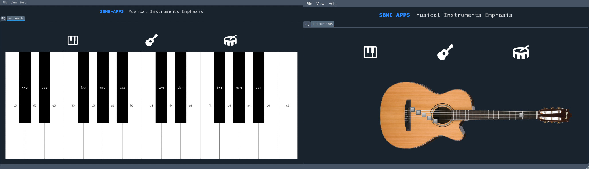

# Music Equalizer and Virtual Instruments
- [Features](#features)
- [Demos](#demos)
    - [Volume Demo](#volume-change-demo)
    - [Equalizer Demo](#equalizer-change-demo)
    - [Instruments Demo](#instruments-demo)

## Features
- Real time plotting for the audio
- Real time Spectrum analysis with the spectrogram.
- Real time equalizer with the provided frequncy ranges
- Volume changing
- Loading multiple audio files.
- Virtual Piano (4th ocatve)
- Virtual Guitar and drum

## Demos

### Volume change demo

### Equalizer change demo

### Instruments Demo

